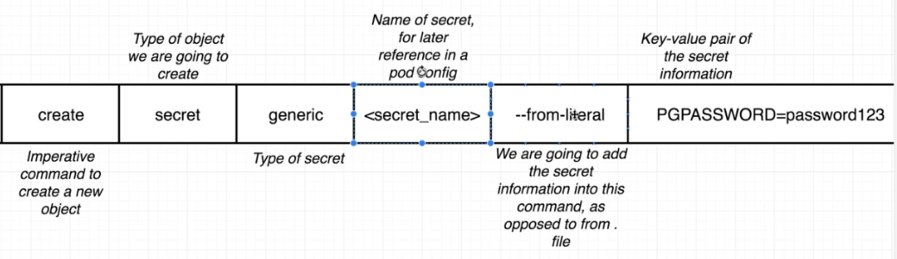
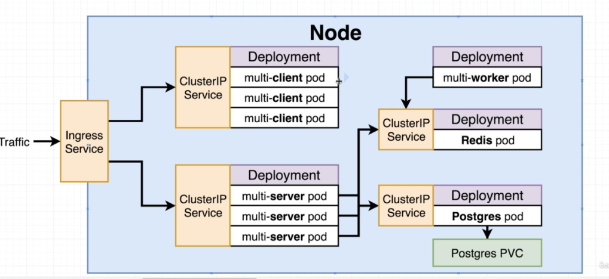
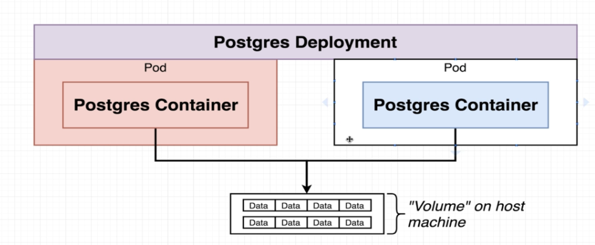
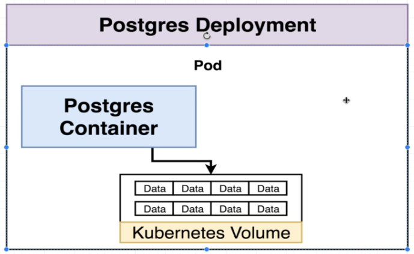
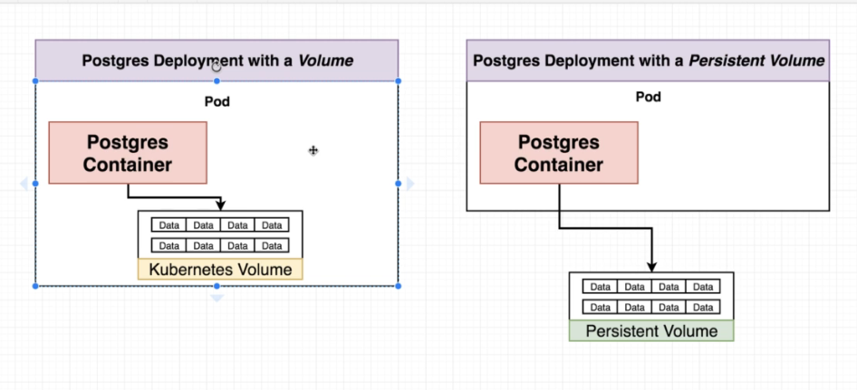
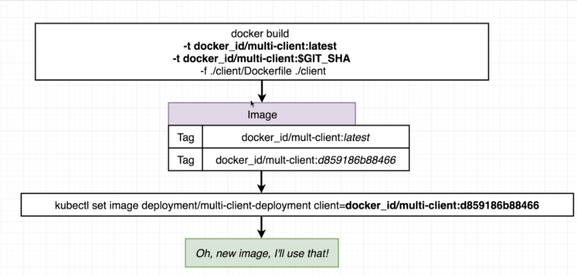
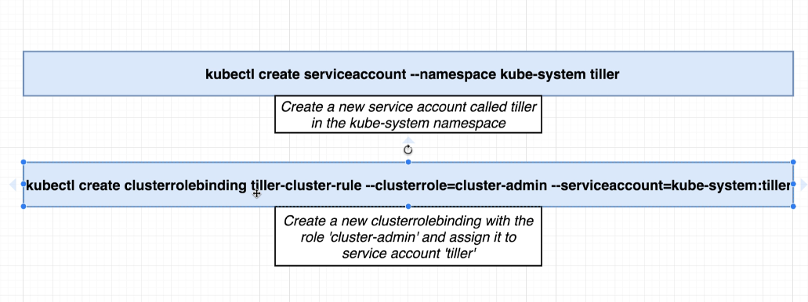

# Kubernetes
## Object types
1. **Pods**: Runs one or more closely related containers
2. **Deployment**: Administers and manages a set of pods
3. **Services**: Sets up networking in a K8s cluster
   1. ClusterIP - *Exposes a set of pods to other objects in the cluster*
   2. NodePort - *Exposes a set of pods to the outside world (only good for dev purposes!)*
   3. Loadbalancer - *legacy way of getting network traffic into a cluster*
   4. Ingress - *Exposes a set of services to the outside world*
4. **Secrets**: Securely stores a piece of information in the cluster, such as a database password
    
#### How to create a secret
Create a secret locally
```
kubectl create secret generic <secret_name> --from-literal key=value
```
```
kubectl create secret generic pgpassword --from-literal PGPASSWORD=12345****
```



## Configurations Diagram


## Volume in K8s




Volume in K8s is an object that allows a conatiner to store data at the pod level

## Volume vs Persistent Volume in K8s


Persistent volume is not tied to any specific pods, completely isolated from the pods.

## Persistent Volume Claim
#### Access Modes
|   Access modes    | Description |
| ----------- | ----------- |
| ReadWriteOnce      | Can be used by a **single node** |
| ReadOnlyMany   | **Multiple nodes** can **read** from this |
| ReadWriteMany | Can be **read and written** to by **many nodes**|


## Update an imageto the latest version
Using **GIT_SHA** on a script for deploying the newest image 



## Installing Helm
Helm is a tool help defining, installing and upgrading applications running on K8s.

[Helm](https://github.com/helm/helm)

[Quick start guide](https://helm.sh/docs/intro/install/)

## Assigning Tiller a Service account 


#### After assigning Tiller
```
helm init --service-account tiller --upgrade
```
*--upgrade flag is to make sure that helm is the latest version*
